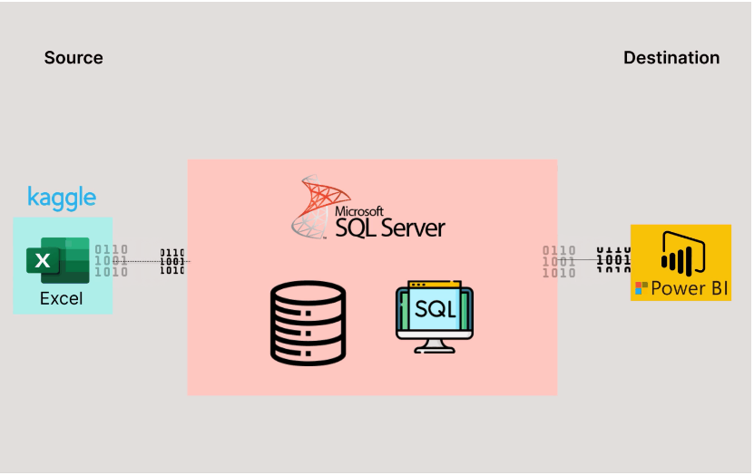

# Data Portfolio: Excel to Power BI

# Table of Contents

- [Objective](#Objective)
- [Data Source](#Data-Source)
- [Stages](#Stages)
- [Design](#Design)
  - [Mockup](#Mockup)
  - [Tools](#Tools)
- [Development](#Development)
  - [Pseudocode](#Pseudocode)
  - [Data Exploration](#Data-Exploration)
  - [Data Cleaning](#Data-Cleaning)
  - [Transforming the Data](#Transforming-the-Data)
  - [Create the SQL View](#Create-the-SQL-View)
- [Testing](#Testing)
  - [Data Quality Tests](#Data-Quality-Tests)
- [Visualization](#Visualization)
  - [Results](#Results)
  - [DAX Measures](#DAX-Measures)
- [Analysis](#Analysis)
  - [Findings](#Findings)
  - [Validation](#Validation)
  - [Discovery](#Discovery)
- [Conclusion](#Conclusion)

# Objective

 ## What is the key main point?

 - The Sales Department is interested in gaining insights into the following areas:

   - ***1. Top Most Frequent Customers:***  Identify the customers who make purchases most frequently to allow the company to tailor loyalty programs and reward them to retain them due to them being an asset to them.

   - ***2. Sales Distribution by Region:***  Analyzing sales performance across different regions and determing which region has the highest sales.
  
   - ***3. Sales Distribution by Country:***  Understanding which product categories are sold the most and which catgories generate the highest profits.
  
   - ***4. Top Profitable Products:***  Identifying the products that yield the most profit.
  
 - ## What is the ideal solution?

    - To create an interactive and insightful Power BI dashboard that provides the Sales Department with key insights into customer behavior, sales performance across regions, product category performance and profitability. This will help the department make informed decisions based on statistics and visual data representations. 
   
    

