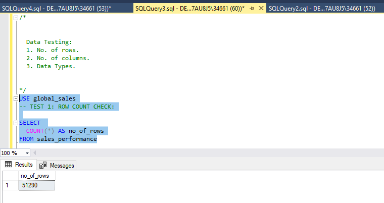
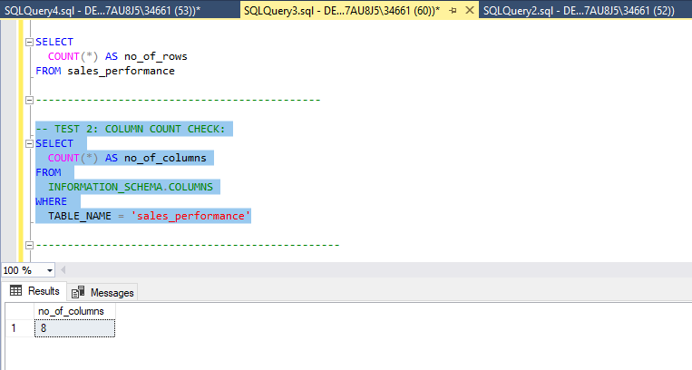
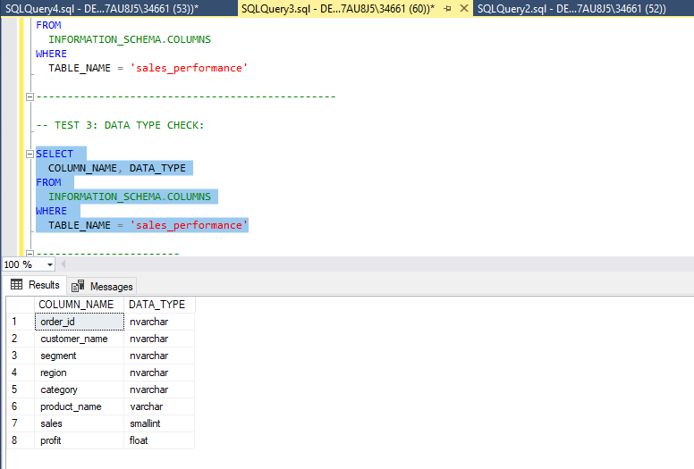
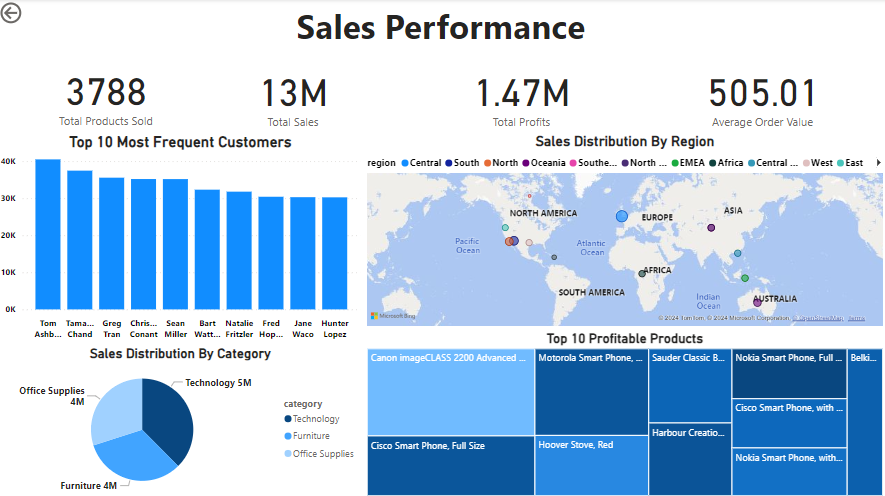

# Data Portfolio: Excel to Power BI


# Table of Contents

- [Objective](#Objective)
- [Data Source](#Data-Source)
- [Stages](#Stages)
- [Design](#Design)
  - [Dashboard Mockup](#Dashboard-Mockup)
  - [Tools](#Tools)
- [Development](#Development)
  - [Pseudocode](#Pseudocode)
  - [Data Cleaning](#Data-Cleaning)
  - [Creating the SQL View](#Creating-the-SQL-View)
- [Testing](#Testing)
- [Visualization](#Visualization)
  - [Results](#Results)
  - [DAX Measures](#DAX-Measures)
- [Analysis](#Analysis)
  - [Findings](#Findings)
  - [Validation](#Validation)
  - [Discovery](#Discovery)
- [Conclusion](#Conclusion)


# Objective

 ## What is the key main point?

 - The Sales Department is interested in gaining insights into the following areas:

   - ***1. Top Most Frequent Customers:***  Identify the customers who make purchases most frequently to allow the company to tailor loyalty programs and reward them to retain them due to them being an asset to them.

   - ***2. Sales Distribution by Region:***  Analyzing sales performance across different regions and determing which region has the highest sales.
  
   - ***3. Sales Distribution by Country:***  Understanding which product categories are sold the most and which catgories generate the highest profits.
  
   - ***4. Top Profitable Products:***  Identifying the products that yield the most profit.
  
 - # What is the ideal solution?

    - To create an interactive and insightful Power BI dashboard that provides the Sales Department with key insights into customer behavior, sales performance across regions, product category performance and profitability. This will help the department make informed decisions based on statistics and visual data representations. 
   

# Data Source

- Our dataset is sourced from Kaggle, specifically from an Excel extract available at [this link](https://www.kaggle.com/datasets/laibaanwer/superstore-sales-dataset?select=SuperStoreOrders.csv). You can access it there.

# Stages

 - Design
 - Development
 - Testing
 - Analysis

## Design

### Dashboard components required

 - What should the dashboard contain based on the requirements provided?

To understand what it should contain, we need to figure out what questions we need the dashboard to answer:

 -  Who are the top most frequent customers?
 -  What is the distribution of sales by region?
 -  How is the sales distribution segmented by category?
 -  What are the top profitable products?

# Dashboard Mockup

- What should it look like?

Some of the data visuals that may be appropriate in answering our questions include:

1. Stacked column chart
2. Pie chart
3. Map
4. Treemap


### Tools

## Tools and Their Purposes

| Tool        | Purpose                                            |
|-------------|----------------------------------------------------|
| Excel       | Exploring the data                                 |
| SQL Server  | Cleaning, testing, and analyzing the data          |
| Power BI    | Visualizing the data via interactive dashboards    |
| GitHub      | Hosting the project documentation and version control |

# Development

## Pseudocode

- What's the general approach in creating this solution from start to finish?

   1. Get the data
   2. Explore the data in Excel
   3. Load the data in SQL Server
   4. Clean the data with SQL
   5. Test the data with SQL
   6. Visualize the data in Power BI
   7. Generate the findings based on the insights
   8. Write the documentation + commentary
   9. Publish the data to GitHub Pages


 # Data Cleaning

 - What do we expect the clean data to look like? (What should it contain? What constraints should we apply to it?)

The aim is to refine our dataset to ensure it is structured and ready for analysis.

The cleaned data should meet the following criteria and constraints:

 - Only relevant columns should be retained.
 - All data types should be appropriate for the contents of each column.
 - No column should contain null values, indicating complete data for all records.

  Below is a table outlining the constraints on our cleaned dataset:

| Property          | Description |
|-------------------|-------------|
| Number of Rows    | 51290       |
| Number of Columns | 8           |

Tabular representation of the expected schemafor the clean data:

| Column Name       | Data Type | Nullable |
|-------------------|-----------|----------|
| order_id          | NVARCHAR  | NO       |
| customer_name     | NVARCHAR  | NO       |
| segment           | NVARCHAR  | NO       |
| region            | NVARCHAR  | NO       |
| category          | NVARCHAR  | NO       |
| product_name      | VARCHAR   | NO       |
| sales             | SMALLINT  | NO       |
| profit            | FLOAT     | NO       |

# Creating the SQL View

```sql
-- Creation of View

CREATE VIEW sales_performance AS
SELECT 
   order_id,customer_name, segment, region, category, product_name, sales, profit  
FROM
   SuperStoreOrders;

```

# Testing

 - What data quality and validation checks are you going to create?

Here are the data quality tests: 

# Row count check

- ***SQL Query***
``` sql
/*
 Count the total number of records (or rows) are in the SQL view
*/
-- TEST 1: ROW COUNT CHECK:

SELECT 
  COUNT(*) AS no_of_rows
FROM sales_performance

```
- ***Output***


# Column check

- ***SQL Query***
``` sql
-- TEST 2: COLUMN COUNT CHECK:
SELECT 
  COUNT(*) AS no_of_columns
FROM 
  INFORMATION_SCHEMA.COLUMNS
WHERE 
  TABLE_NAME = 'sales_performance'

```

- ***Output***



# Data type check

- ***SQL Query***
``` sql
  SELECT 
  COLUMN_NAME, DATA_TYPE
FROM 
  INFORMATION_SCHEMA.COLUMNS
WHERE 
  TABLE_NAME = 'sales_performance'

```
- ***Output***



# Visualization

# Results

 - What does the dashboard look like?
  


# DAX Measures

# 1. Total Sales 

``` DAX

Total Sales = 
VAR totalSales = SUM(sales_performance[sales])
RETURN totalSales

```

# 2. Total Profits

``` DAX

Total Profits = 
VAR totalProfits = SUM(sales_performance[profit])
RETURN totalProfits

```

# 3. Total Products Sold

``` DAX

Total Products Sold = 
VAR totalProductsSold = DISTINCTCOUNT(product_name)
RETURN totalProductsSold

```


# 4. Average Order Value

``` DAX

Average Order Value = 
VAR avgOrderValue = SUM(sales_performance[sales]) / DISTINCTCOUNT(sales_performance[order_id])
RETURN avgOrderValue

```

# Analysis

 - What did we find?

- ***1. Who are the top most frequent customers?***

|      | customer_name        | total_sales     |
|------|----------------------|-----------------|
| 1    | Tom Ashbrook         | 40489           |
| 2    | Tamara Chand         | 37453           |
| 3    | Greg Tran            | 35552           |
| 4    | Christopher Conant   | 35187           |
| 5    | Sean Miller          | 35170           |
| 6    | Bart Watters         | 32315           |
| 7    | Natalie Fritzler     | 31778           |
| 8    | Fred Hopkins         | 30404           |
| 9    | Jane Waco            | 30288           |
| 10   | Hunter Lopez         | 30246           |

- ***2. What is the distribution of sales by region?***

|      | customer_name        | total_sales     | total_profits   |
|------|----------------------|-----------------|-----------------|
| 1    | Central              | 2822399         | 311404          |
| 2    | South                | 1600960         | 140356          |
| 3    | North                | 1248192         | 194598          |
| 4    | Oceania              | 1100207         | 121667          |
| 5    | Southeast Asia       | 884438          | 17852           |
| 6    | North Asia           | 848349          | 165578          |
| 7    | EMEA                 | 806184          | 43898           |
| 8    | Africa               | 783776          | 88872           |
| 9    | Central Asia         | 752839          | 132480          |
| 10   | West                 | 725514          | 108418          |
| 11   | East                 | 678834          | 91523           |
| 12   | Carribean            | 324281          | 34571           |
| 13   | Canada               | 66932           | 17817           |

- ***3. How is the sales distribution segmented by category?***

|      | category              | total_sales     | profits         |
|------|----------------------|-----------------|-----------------|
| 1    | Technology           | 4744691         | 663779          |
| 2    | Furniture            | 4110884         | 286782          |
| 3    | Office Supplies      | 3787330         | 518474          |


- ***4. What are the top profitable products?***

|      | product_name         | profits         |
|------|----------------------|-----------------|
| 1    | Canon imageCLASS 2200| 25200           |
| 2    | Cisco SmartPhone, FS | 17239           |
| 3    | Motorola Full Size   | 17027           |
| 4    | Hoover Stove, Red    | 11808           |
| 5    | Sauder Classic       | 10672           |
| 6    | Harbour Creations    | 10427           |
| 7    | Nokia Full Size      | 9938            |
| 8    | Cisco,Caller ID      | 9787            |
| 9    | Nokia,Caller ID      | 9465            |
| 10   | Belkin Router,USB    | 8955            |


